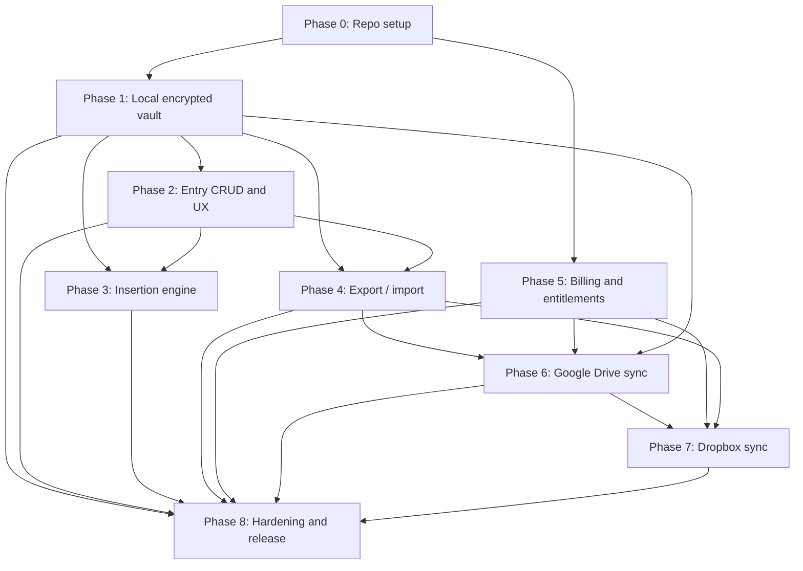

# Encrypted ID Vault Implementation Plan

Date: 2026-07-16
Source of truth: [encrypted-id-vault-prd.md](encrypted-id-vault-prd.md)

## Purpose
This document turns the PRD into an execution-ready engineering plan. It is intentionally opinionated and sequenced to minimize security risk: ship the local encrypted vault first, then export/import, then billing, then provider sync.

## Planning assumptions
- Chrome desktop is the first release target.
- Manifest V3 is mandatory.
- The extension must never persist plaintext vault values.
- Decrypted secrets may exist only in memory during an unlocked session.
- Cloud sync moves only encrypted vault files.
- Google Drive uses the narrowest viable scope, preferably `drive.file`.
- Dropbox uses public-client-safe OAuth with PKCE.
- No enterprise, team, mobile, or password-manager scope creep in v1.

## Ownership model
These are role-based owners, not named people.

- Product / Staff Engineer: scope control, sequencing, tradeoffs, milestone acceptance.
- Extension Engineer: MV3 manifest, UI, background service worker, content scripts, browser compatibility.
- Security Engineer: crypto, storage review, message validation, threat model, release security checklist.
- Backend Engineer: billing backend, entitlement APIs, webhook handling, account linking.
- QA / Release Engineer: test infrastructure, browser matrix, store packaging, manual verification.

## Milestone map

| Milestone | Owner                                       | Goal                             | Exit criteria                                                                                     |
| --------- | ------------------------------------------- | -------------------------------- | ------------------------------------------------------------------------------------------------- |
| M0        | Product / Staff Engineer                    | Repo and engineering standards   | Repo builds, tests run, architecture boundaries are documented, security conventions are in place |
| M1        | Security Engineer + Extension Engineer      | Local encrypted vault foundation | Create/unlock works, vault is encrypted at rest, lock clears session state                        |
| M2        | Extension Engineer                          | Entry CRUD and vault UX          | Entries can be created, edited, deleted, searched, and masked in the UI                           |
| M3        | Extension Engineer                          | Controlled insertion engine      | Selected entry inserts into focused field only after explicit user action                         |
| M4        | Security Engineer + Extension Engineer      | Encrypted export/import          | Vault can be exported/imported as ciphertext only, tampered files are rejected                    |
| M5        | Backend Engineer + Product / Staff Engineer | Billing and entitlements         | Free/Pro/Lifetime are enforced without blocking local vault access                                |
| M6        | Backend Engineer + Extension Engineer       | Google Drive sync                | Encrypted vault syncs across devices through Drive with conflict handling                         |
| M7        | Backend Engineer + Extension Engineer       | Dropbox sync                     | Dropbox sync works with PKCE and the same encrypted vault contract                                |
| M8        | QA / Release Engineer + Security Engineer   | Hardening and store readiness    | Browser matrix passes, storage inspection passes, release packaging is ready                      |

## Dependency graph

## Phase-by-phase execution plan

### Phase 0: Repo setup and engineering standards
Owner: Product / Staff Engineer

Goals:
- Establish the project structure, tooling, and security guardrails.
- Prevent architectural drift before implementation starts.

Deliverables:
- Monorepo layout for extension, backend, and shared packages.
- TypeScript, lint, format, test, and build pipelines.
- MV3 manifest shell and minimal extension skeleton.
- Backend scaffold with health endpoint and webhook placeholders.
- Security checklist for plaintext handling, permissions, logging, and message validation.

Dependencies:
- None.

Major risks:
- Overengineering the scaffold.
- Choosing a UI or state stack that fights MV3.
- Leaving module boundaries ambiguous.

Exit criteria:
- The repository can build and run a shell extension.
- The team agrees on where crypto, storage, UI, and backend logic belong.
- No secrets, provider tokens, or real data are needed to run the skeleton.

### Phase 1: Secure local vault foundation
Owner: Security Engineer

Goals:
- Create, encrypt, unlock, and lock the vault safely.
- Prove that the local vault can exist without plaintext persistence.

Deliverables:
- Master password create/unlock flow.
- KDF and encryption envelope.
- Encrypted vault storage format.
- Vault repository and persistence adapter.
- Lock/unlock state machine and auto-lock timer.
- First-run bootstrap flow.

Dependencies:
- Phase 0.

Major risks:
- Plaintext values being written to persistent storage.
- Using a weak or incompatible KDF.
- Treating the service worker as a safe place for long-lived decrypted state.

Exit criteria:
- A user can create a vault, unlock it again, and close or lock it without leaving decrypted secrets in persistent storage.
- Wrong passwords fail safely.
- Lock removes decrypted state from session memory.

### Phase 2: Entry CRUD and vault UX
Owner: Extension Engineer

Goals:
- Make the vault useful for daily entry management.
- Keep secrets masked by default.

Deliverables:
- Entry list UI.
- Create, edit, delete, reorder, favorite, and categorize entries.
- Search and masked preview behavior.
- Onboarding and settings entry points.
- Local audit timeline.

Dependencies:
- Phase 1.

Major risks:
- Showing raw values in lists, search, or previews.
- Slow rendering with hundreds of entries.
- Weak keyboard accessibility.

Exit criteria:
- Users can manage entries end to end.
- The list remains responsive at 500+ entries.
- No raw secrets are needed for navigation.

### Phase 3: Controlled insertion engine
Owner: Extension Engineer

Goals:
- Insert a selected value into the focused field only when the user explicitly asks for it.

Deliverables:
- Content script field detection.
- Direct insertion into inputs, textareas, and common contenteditable cases.
- Popup and shortcut insert actions.
- Context menu entry point if retained.
- Clipboard fallback with warning and auto-clear policy where possible.

Dependencies:
- Phases 1 and 2.

Major risks:
- Incorrect field targeting.
- Insertion into password fields.
- Using clipboard as the default path instead of a fallback.

Exit criteria:
- User can focus a field, choose an entry, and insert it on major sites using standard form controls.
- If direct insertion fails, the user gets a safe fallback path.
- No background autofill occurs.

### Phase 4: Encrypted export/import
Owner: Security Engineer

Goals:
- Support portability without weakening the vault security model.

Deliverables:
- Encrypted export file format.
- Import validation and tamper rejection.
- Replace and merge flows.
- Schema versioning and migration hooks.

Dependencies:
- Phases 1 and 2.

Major risks:
- Exporting sensitive data in metadata.
- Making import destructive or confusing.
- Not planning for schema changes.

Exit criteria:
- Exported files contain ciphertext only.
- Import succeeds with the correct password and rejects corrupted files cleanly.

### Phase 5: Billing and entitlements
Owner: Backend Engineer

Goals:
- Gate paid sync features without blocking local vault access.

Deliverables:
- Razorpay checkout integration.
- Account linking flow.
- Signed entitlement issuance.
- Entitlement cache and refresh logic in the extension.
- Billing/account UI and failure handling.

Dependencies:
- Phase 0.
- A stable local vault UX from Phases 1 to 4.

Major risks:
- Entitlement state becoming coupled to vault unlock.
- Billing outages blocking local use.
- Confusing free versus Pro versus lifetime behavior.

Exit criteria:
- Free, Pro, and Lifetime states are enforced correctly.
- Local vault access still works if billing services are unavailable.

### Phase 6: Google Drive sync
Owner: Backend Engineer + Extension Engineer

Goals:
- Add the first cloud sync provider using the narrowest viable access model.

Deliverables:
- Drive OAuth flow.
- Encrypted file create, update, and download.
- Remote file pointer tracking.
- Conflict detection and user choice flow.
- Disconnect and revoke UX.

Dependencies:
- Phases 1, 4, and 5.

Major risks:
- Requesting overly broad Drive scopes.
- Persisting tokens too broadly.
- Silent overwrite during conflict resolution.

Exit criteria:
- The same encrypted vault can sync across two devices and unlock successfully.
- Conflicts are surfaced before overwrite.

### Phase 7: Dropbox sync
Owner: Backend Engineer + Extension Engineer

Goals:
- Add the second provider without changing the vault model.

Deliverables:
- Dropbox OAuth with PKCE.
- Encrypted file operations.
- Token refresh and reconnect handling.
- Disconnect and revoke UX.

Dependencies:
- Phases 1, 4, 5, and 6 patterns.

Major risks:
- Diverging from the Drive sync contract.
- Embedding or implying a reusable client secret.
- Duplicating sync logic instead of sharing abstractions.

Exit criteria:
- Dropbox behaves like Drive from the user’s point of view.
- No plaintext is exposed during auth or sync.

### Phase 8: Hardening, QA, and store readiness
Owner: QA / Release Engineer

Goals:
- Prove the product is secure, compatible, and publishable.

Deliverables:
- Browser compatibility matrix.
- Storage inspection tests.
- Security review pass.
- Performance and accessibility checks.
- Release packaging for Chrome Web Store and Edge Add-ons.
- Privacy policy and store listing assets.

Dependencies:
- Phases 1 to 7.

Major risks:
- Hidden plaintext leaks.
- Store policy issues.
- Browser-specific regressions.

Exit criteria:
- Chrome stable, Edge stable, Brave stable, and Opera stable pass the core flow.
- Storage inspection finds no plaintext vault values.
- Release artifacts are ready for submission.

## Detailed task breakdown

This section is the implementation backlog. It is ordered so the first tasks unblock the cryptographic core and the later tasks layer on UX, sync, billing, and release polish.

### Manifest and permissions
| Task                                                | Why it exists                                                                | Complexity | Dependencies                               | Done criteria                                                                                                   |
| --------------------------------------------------- | ---------------------------------------------------------------------------- | ---------: | ------------------------------------------ | --------------------------------------------------------------------------------------------------------------- |
| Define MV3 manifest and extension surfaces          | The manifest is the security boundary and controls what the extension can do |          M | Phase 0                                    | Popup, options, service worker, and content script entries are declared with only the permissions needed for v1 |
| Minimize permissions and host access                | Least privilege is required for store approval and security review           |          M | Define MV3 manifest and extension surfaces | Required permissions are documented and optional permissions are isolated behind feature gates                  |
| Add command shortcuts and context menu declarations | Insertion must be user initiated through obvious surfaces                    |          S | Define MV3 manifest and extension surfaces | Keyboard shortcut and context menu hooks resolve to the insertion flow without broad page access                |

### Popup UI
| Task                                                     | Why it exists                                              | Complexity | Dependencies     | Done criteria                                                                |
| -------------------------------------------------------- | ---------------------------------------------------------- | ---------: | ---------------- | ---------------------------------------------------------------------------- |
| Build locked and unlocked popup states                   | The popup is the primary daily entry point                 |          L | Phase 1          | User can unlock, see locked state, and relock from the popup                 |
| Build searchable entry list                              | Fast retrieval is required for real use                    |          L | Phase 2          | Search returns entries quickly and masks values by default                   |
| Add quick actions for insert, reveal, copy, and favorite | Users need low-friction actions on frequently used entries |          M | Phase 2, Phase 3 | Each action is explicit and routes through the correct security checks       |
| Add sync and upgrade status area                         | Paid features must be visible without exposing secrets     |          S | Phase 5          | Free and Pro states render clearly and do not interfere with local vault use |

### Options and settings page
| Task                               | Why it exists                                           | Complexity | Dependencies              | Done criteria                                                                      |
| ---------------------------------- | ------------------------------------------------------- | ---------: | ------------------------- | ---------------------------------------------------------------------------------- |
| Build full vault settings screen   | Users need a place for security and preference controls |          M | Phase 2                   | Auto-lock, reveal, clipboard, and theme settings are editable and persisted safely |
| Build entry manager screen         | Bulk editing is better suited to a full page            |          L | Phase 2                   | Users can CRUD and reorder entries in a larger layout                              |
| Build export/import flows          | Portability is required before sync                     |          M | Phase 4                   | Users can export, import, replace, or merge a vault from the settings page         |
| Build provider and billing screens | Sync and Pro state need a clear management surface      |          M | Phase 5, Phase 6, Phase 7 | Users can connect, disconnect, and inspect provider state and entitlement status   |

### Background service worker
| Task                                                | Why it exists                                             | Complexity | Dependencies | Done criteria                                                                       |
| --------------------------------------------------- | --------------------------------------------------------- | ---------: | ------------ | ----------------------------------------------------------------------------------- |
| Implement message routing and schema validation     | All cross-component communication must be validated       |          M | Phase 0      | Invalid messages are rejected and valid messages route to the correct handler       |
| Implement alarms and lock timers                    | Auto-lock must work even when the UI is closed            |          M | Phase 1      | Inactivity and restart lock behavior are enforced reliably                          |
| Implement orchestration for sync and billing events | Provider and entitlement flows need a central coordinator |          M | Phase 5      | The worker can request sync and entitlement refresh without holding plaintext state |

### Content scripts
| Task                                   | Why it exists                                                 | Complexity | Dependencies | Done criteria                                                                         |
| -------------------------------------- | ------------------------------------------------------------- | ---------: | ------------ | ------------------------------------------------------------------------------------- |
| Detect focused editable fields         | Insertion must target the field the user is actually editing  |          M | Phase 3      | Inputs, textareas, and common contenteditable elements are detected safely            |
| Insert values with proper events       | Many sites require input and change events to fire correctly  |          M | Phase 3      | Inserted values appear correctly on major sites and event listeners react as expected |
| Reject password and unsupported fields | The extension must never write secrets into the wrong element |          S | Phase 3      | Password fields and unsupported targets are blocked with a safe user message          |

### Crypto module
| Task                                             | Why it exists                                           | Complexity | Dependencies | Done criteria                                                             |
| ------------------------------------------------ | ------------------------------------------------------- | ---------: | ------------ | ------------------------------------------------------------------------- |
| Implement KDF derivation                         | The master password must become a strong encryption key |          L | Phase 1      | A versioned key derivation path exists with per-vault salt and parameters |
| Implement vault encryption and decryption        | This is the core security primitive                     |          L | Phase 1      | Data encrypts and decrypts correctly and fails safely on tampering        |
| Implement schema versioning and integrity checks | Future migrations and corruption detection depend on it |          M | Phase 1      | Versioned vault envelopes are validated before any plaintext is exposed   |

### Vault repository and storage layer
| Task                                             | Why it exists                                            | Complexity | Dependencies | Done criteria                                                     |
| ------------------------------------------------ | -------------------------------------------------------- | ---------: | ------------ | ----------------------------------------------------------------- |
| Abstract storage reads and writes                | Storage access needs a single controlled boundary        |          M | Phase 1      | All persistent vault operations flow through the repository layer |
| Store encrypted vault blob and metadata          | Persistent storage must never contain plaintext secrets  |          M | Phase 1      | Inspection of storage shows ciphertext only for vault contents    |
| Store non-sensitive preferences and audit events | The product needs durable configuration and transparency |          S | Phase 2      | Preferences and audit events persist without exposing secrets     |

### Session lock and unlock handling
| Task                                      | Why it exists                                             | Complexity | Dependencies     | Done criteria                                                                 |
| ----------------------------------------- | --------------------------------------------------------- | ---------: | ---------------- | ----------------------------------------------------------------------------- |
| Build unlock session lifecycle            | Decrypted state must exist only while explicitly unlocked |          L | Phase 1          | Unlock creates a session and lock destroys it predictably                     |
| Build auto-lock and restart lock behavior | The vault must not remain open accidentally               |          M | Phase 1          | Inactivity and browser restart both return the vault to locked state          |
| Build manual lock and re-prompt controls  | High-sensitivity actions need explicit user control       |          M | Phase 1, Phase 2 | Manual lock is always available and sensitive actions can require a re-prompt |

### Export and import
| Task                                | Why it exists                                      | Complexity | Dependencies | Done criteria                                                 |
| ----------------------------------- | -------------------------------------------------- | ---------: | ------------ | ------------------------------------------------------------- |
| Export encrypted vault files        | Portability is a core product promise              |          M | Phase 4      | Exported file contains only ciphertext and safe metadata      |
| Import and validate files           | Users need a safe restore path on new devices      |          M | Phase 4      | Invalid, tampered, or incompatible files are rejected clearly |
| Implement replace and merge choices | Imports must be controlled rather than destructive |          M | Phase 4      | The user can choose how to handle conflicts during import     |

### Google Drive adapter
| Task                                           | Why it exists                                | Complexity | Dependencies     | Done criteria                                                             |
| ---------------------------------------------- | -------------------------------------------- | ---------: | ---------------- | ------------------------------------------------------------------------- |
| Implement Drive OAuth with narrow scope        | Drive access must be as limited as possible  |          L | Phase 5, Phase 6 | The flow requests only the minimum viable scope and returns usable tokens |
| Implement encrypted file upload and download   | Sync must never expose plaintext to Drive    |          L | Phase 6          | Upload and download operate only on encrypted vault files                 |
| Implement remote pointer and conflict handling | Sync must not overwrite data silently        |          M | Phase 6          | Divergent versions are detected and require explicit user choice          |
| Implement disconnect and revoke flow           | Users must be able to revoke provider access |          S | Phase 6          | Disconnect removes provider linkage and surfaces revocation guidance      |

### Dropbox adapter
| Task                                           | Why it exists                                               | Complexity | Dependencies     | Done criteria                                                            |
| ---------------------------------------------- | ----------------------------------------------------------- | ---------: | ---------------- | ------------------------------------------------------------------------ |
| Implement Dropbox OAuth with PKCE              | Public-client-safe auth is required                         |          L | Phase 5, Phase 7 | OAuth works without embedding a reusable client secret                   |
| Reuse the encrypted file sync contract         | The second provider should not create a separate sync model |          M | Phase 7          | Dropbox uses the same vault envelope and conflict rules as Drive         |
| Implement reconnect and token refresh handling | Sync must recover from token expiry                         |          M | Phase 7          | Expired auth results in a clear reconnect path instead of silent failure |

### Billing and entitlement module
| Task                                      | Why it exists                                                  | Complexity | Dependencies | Done criteria                                                              |
| ----------------------------------------- | -------------------------------------------------------------- | ---------: | ------------ | -------------------------------------------------------------------------- |
| Implement checkout and account linking    | Users need a clear paid upgrade path                           |          M | Phase 5      | The extension can link to an external account and resolve purchase state   |
| Implement signed entitlement verification | Paid features must fail closed and remain trustworthy          |          M | Phase 5      | The extension caches and refreshes entitlement status safely               |
| Implement feature gating for sync only    | Local vault access must stay available even when billing fails |          S | Phase 5      | Sync is blocked when entitlement is invalid, but local vault use continues |

### Telemetry and audit log
| Task                             | Why it exists                              | Complexity | Dependencies | Done criteria                                                                            |
| -------------------------------- | ------------------------------------------ | ---------: | ------------ | ---------------------------------------------------------------------------------------- |
| Log local vault lifecycle events | Transparency improves trust                |          S | Phase 2      | Vault create, unlock, insert, copy, export, and sync events are recorded without secrets |
| Add redaction and clear controls | Audit data must never become a secret leak |          S | Phase 2      | User can clear history and logs never contain plaintext values                           |

### Test infrastructure
| Task                                     | Why it exists                                            | Complexity | Dependencies | Done criteria                                                             |
| ---------------------------------------- | -------------------------------------------------------- | ---------: | ------------ | ------------------------------------------------------------------------- |
| Set up unit tests for crypto and schemas | Core invariants need fast feedback                       |          M | Phase 0      | Crypto, message schemas, and migration logic are covered                  |
| Set up browser-level extension tests     | The main flows only matter in a real browser             |          L | Phase 0      | Popup, options, insertion, and lock/unlock are automated                  |
| Set up storage inspection tests          | Security depends on the absence of plaintext persistence |          L | Phase 1      | CI checks browser storage and exported files for plaintext leakage        |
| Set up provider and billing mocks        | Sync and checkout need isolated verification             |          M | Phase 5      | Drive, Dropbox, and Razorpay scenarios are testable without real accounts |

### Release packaging
| Task                                     | Why it exists                                      | Complexity | Dependencies | Done criteria                                                                       |
| ---------------------------------------- | -------------------------------------------------- | ---------: | ------------ | ----------------------------------------------------------------------------------- |
| Produce Chrome Web Store packaging       | Chrome is the first release target                 |          M | Phase 8      | Build artifacts and listing metadata are store-ready                                |
| Produce Edge Add-ons packaging           | Edge compatibility is a direct requirement         |          M | Phase 8      | The same build passes Edge packaging checks with minimal changes                    |
| Prepare privacy and security disclosures | Store approval and trust depend on clear messaging |          S | Phase 8      | Privacy policy, permissions explanations, and paid feature disclosures are complete |

## Milestones with suggested owner handoff

### M0 handoff sequence
1. Product / Staff Engineer defines scope and acceptance boundaries.
2. Extension Engineer creates the MV3 shell and workspace layout.
3. Security Engineer approves baseline security conventions.
4. QA / Release Engineer adds the first build and test commands.

### M1 handoff sequence
1. Security Engineer implements the crypto envelope and vault format.
2. Extension Engineer wires the UI to the vault repository.
3. QA / Release Engineer adds storage inspection tests.

### M2 handoff sequence
1. Extension Engineer builds CRUD and search flows.
2. Security Engineer reviews masking and metadata exposure.
3. QA / Release Engineer validates accessibility and performance.

### M3 handoff sequence
1. Extension Engineer implements insertion mechanics.
2. Security Engineer reviews field targeting and clipboard rules.
3. QA / Release Engineer runs browser-level insertion tests.

### M4 handoff sequence
1. Security Engineer validates export/import format and tamper handling.
2. Extension Engineer integrates export/import UX.
3. QA / Release Engineer verifies round-trip behavior.

### M5 handoff sequence
1. Backend Engineer implements billing and entitlement issuance.
2. Product / Staff Engineer defines paid feature boundaries.
3. Extension Engineer consumes signed entitlements and gates sync only.

### M6 and M7 handoff sequence
1. Extension Engineer implements provider adapters.
2. Backend Engineer supports auth and token lifecycle concerns.
3. Security Engineer reviews scopes, token handling, and sync files.
4. QA / Release Engineer validates conflict flows and recovery paths.

### M8 handoff sequence
1. Security Engineer runs the final security checklist.
2. QA / Release Engineer runs browser matrix and packaging checks.
3. Product / Staff Engineer gives final go/no-go based on acceptance criteria.

## Release sequencing recommendation
1. Local vault MVP.
2. Export/import and settings.
3. Billing and entitlement scaffolding.
4. Google Drive sync.
5. Dropbox sync.
6. Harden and ship.

## What to defer explicitly
- Team, enterprise, or admin features.
- Mobile browser support.
- Password manager scope.
- Passkeys, TOTP, or credential autofill.
- Record-level sync.
- Multi-provider simultaneous sync.
- Rich collaboration or sharing.
- Complex offline merge logic.

## Open decisions and recommendation defaults
- Free export/import: allow it, because portability supports the local-first safety story.
- Free tier entry limit: use 25 entries initially.
- Label encryption: keep labels plaintext in v1 for usability and search, unless a later review changes that.
- KDF: use Argon2id.
- Account creation: require it only when the user enters billing or sync flows.
- Provider count in v1: support one active provider connection at a time.
- Clipboard fallback: keep it opt-in and never default.
- Backend size: keep it minimal and billing-focused.

## Working notes for future days
- Do not start implementation until Phase 0 has a signed-off directory layout and security boundary map.
- Do not let sync or billing code leak into the vault crypto layer.
- Do not optimize for portability across non-Chromium browsers until Chrome/Edge/Brave/Opera pass the local vault flow.
- If a task cannot be isolated to one phase, park it and reduce the phase boundary rather than broadening scope.
